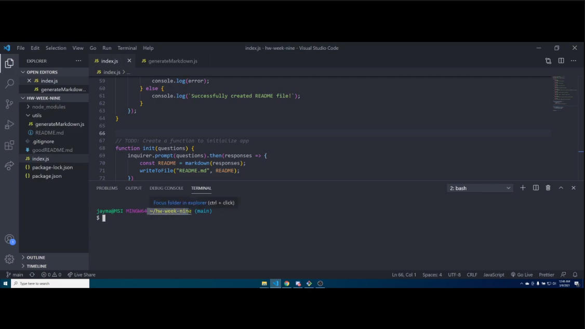

  # hw-week-nine
  
  ## Project Description

  This project is a simple README generator utilizing basic back-end technologies (JavaScript, node.js, npm, Inquirer). Through Inquirer prompts in the terminal, users can quickly generate professional looking README files for their projects.

  ## Table of Contents

  [Installation](#installation)

  [Usage](#usage)

  [License](#license)

  [Contributing](#contributing)

  [Tests](#testing)
  
  [Questions/Contact](#questions)

  ## Installation

  Run the following command to install all dependancies for this project:

  ~~~
  npm i
  ~~~

  ## Usage

  Download or clone this repo and download dependencies (see Instructions for downloading dependencies).

  ## License

  

  This project is registered under the MIT license.

  To learn more about this license, visit (https://choosealicense.com/licenses/mit/)

  ## Testing

  Run the following command to test this project:

  ~~~
  npm test
  ~~~

  ## Questions

  If you have any questions, comments, or concerns about this project, you can reach me at the following links:
  
  Email: jaymanw2000@gmail.com
  
  GitHub: [JaymanW](https://github.com/JaymanW)
  
